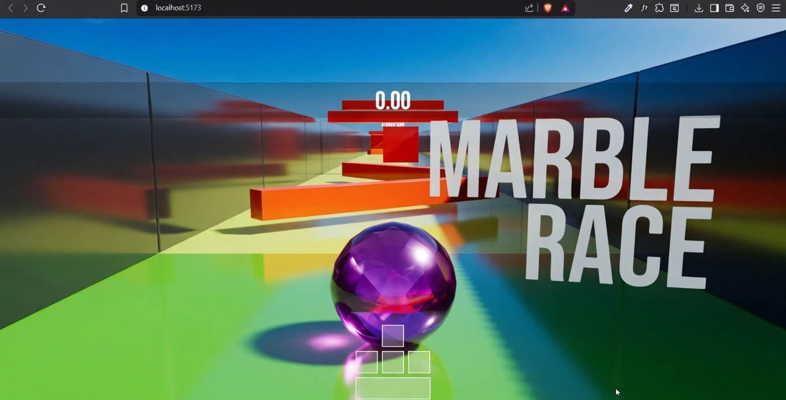
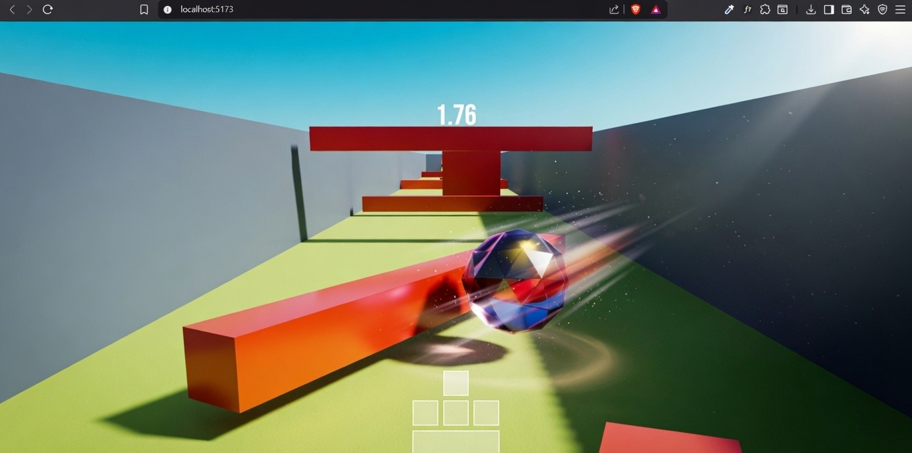
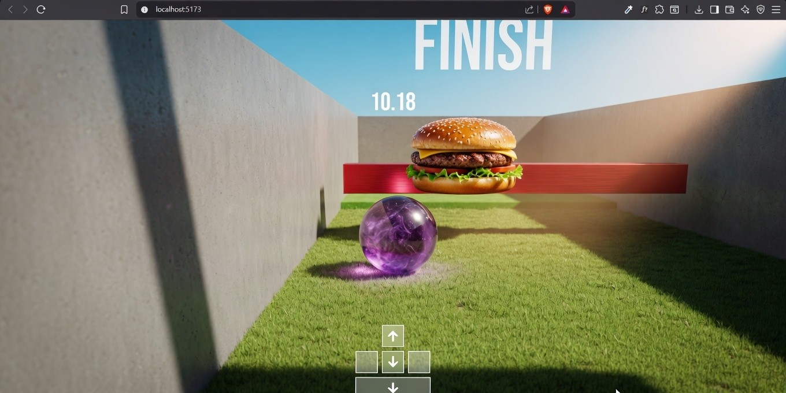

# 🟣 Marble Race

A fun **physics-based marble running game** built with **React Three Fiber** and **Rapier**.

Roll fast, dodge obstacles, and reach the hamburger in the best time possible! 🍔



## ✨ Features

- Realistic physics with **Rapier**
- Procedural obstacle generation
- Smooth third-person camera
- Multiple trap types (Spinner, Limbo, Axe)
- Timer & scoring system
- Restart functionality
- Built with **React Three Fiber + Drei**



## 🎮 Controls

- **Move** — `W` `A` `S` `D`
- **Jump** — `Space`
- **Restart** — `R`



## 🛠️ Tech Stack

- **React Three Fiber** (Three.js)
- **@react-three/rapier** — Physics
- **Zustand** — State management
- **Drei** — Helpers & utilities
- **Vite + TypeScript**

## 🚀 How to Run

```bash
# Clone the repository
git clone https://github.com/ojasss11/threejs-journey.git

# Navigate to the project
cd threejs-journey/game-with-r3f

# Install dependencies
npm install

# Start the development server
npm run dev
```
